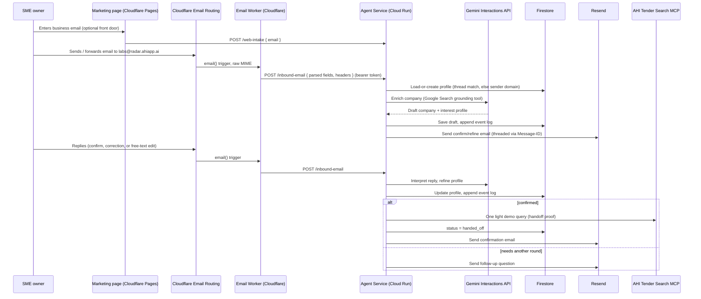

# Experience 1 — Onboarding Agent — Implementation Plan

**Scope of this repo:** Experience 1 only — "email us, you're in." Experience 2 (the weekly report agent) is a separate squad/repo; this repo only needs to produce the artifact Experience 2 consumes (a confirmed company/interest profile) and demonstrate the handoff with a light MCP query.

Source of truth: `AHI Hackathon — August 2026 — Build Brief - Actual.pdf` (kept local-only, see `.gitignore` — it's not committed).

---

## 1. What we're building

One agent behind a dedicated address (working name `labs@radar.ahiapp.ai`), with a minimal marketing page as a second front door into the same flow:

```
email in (cold, or forwarded mid-thread, zero context)
  → domain-based company enrichment (Gemini + Google Search grounding)
  → draft profile emailed back: "here's what we found — confirm or add"
  → confirm/refine loop over email (repeat until confirmed)
  → save profile
  → hand off to Experience 2 (demonstrated via one light AHI MCP query)
```

**The hero mechanic:** forwardability. Onboarding has to survive arriving mid-thread, forwarded, with zero prior context — a colleague forwards "just email these guys" and the flow still works cold, keyed only off the sender's email domain, not off thread history we can't trust.

**Explicitly out of scope** (per brief): billing, login/accounts, WhatsApp/SMS, dashboards. The web page only markets and captures an email address; email does all the actual work; the MCP is barely touched (one demo query, not a search feature).

**Proved when:** a cold address goes end-to-end — email in → enriched profile back → confirmed — on the Gemini stack, and the enrichment reads researched, not templated.

---

## 2. Architecture

Two products do the inbound/outbound email plumbing (Cloudflare — already a paid account on the team); one product does the thinking and owns the required GCP + Gemini footprint (Cloud Run).



**Why this split:**
- Cloudflare has no GCP presence, so the Worker stays a thin adapter: parse MIME, forward to Cloud Run, nothing more. All the actual "AI is doing the work" happens in Cloud Run, which is also where the ≥1 GCP product requirement lives structurally, not as an afterthought.
- Cloud Run calling the Gemini API satisfies "≥1 Gemini API call in the deployed app" on the same request path that does real work — not a decorative call bolted on for the checkbox.
- Firestore keeps everything else GCP-native too (no third external dependency to wire credentials for this week), and gives us a natural place to write the append-only event log the "log everything" criterion wants.

---

## 3. Stack decisions

| Layer | Choice | Why |
|---|---|---|
| Agent service | **Node.js / TypeScript**, Fastify, on **Cloud Run** | Matches the team's existing Open_Tenders/Lane E stack; same language as the Cloudflare Worker end-to-end; `@google/genai` has a first-class Node/TS SDK. |
| Inbound email | **Cloudflare Email Routing** → Worker (TypeScript) | Team already has a paid Cloudflare account; this is the standard, documented way to receive inbound mail without running our own SMTP. Worker parses MIME with `postal-mime`, then `fetch()`s the parsed payload to the Cloud Run service. |
| Outbound email | **Resend** | Per brief. One dedicated sending subdomain, threaded via `Message-ID`/`In-Reply-To`/`References`. |
| Web front door | Static page on **Cloudflare Pages** | Genuinely minimal — one form, one POST to the same Cloud Run intake endpoint the email path uses. No framework needed. |
| Profile + thread-state storage | **Firestore** (Native mode) | Serverless, zero ops, reinforces the GCP footprint, trivial client from Cloud Run. Not in the brief explicitly — team call, easy to swap if it becomes friction. |
| AI | **Gemini Interactions API** (`gemini-3.6-flash` default) with the built-in **Google Search grounding** tool for enrichment, and the **MCP tool** registration pointed at `https://connect.ahiapp.ai/mcp` for the handoff-proof query | Confirmed live at `ai.google.dev/gemini-api/docs/custom-agents` — built-in tools include Search grounding, Code Execution, URL Context, plus registering remote MCP servers directly. |
| Logging | **Cloud Logging** (automatic on Cloud Run, structured via Fastify/Pino) + a Firestore `events` collection | Cloud Logging covers infra-level logs for free; the Firestore event log is our own append-only trail (every inbound email, every Gemini call, every Resend send, every MCP call) that doubles as demo-able evidence, not just log lines nobody reads. |

None of this is "don't debate, just build" territory per the brief — the brief pins *products* (Gemini, GCP, Resend, Cloudflare routing), not language or database. The above are this squad's calls, and cheap to revisit if they cause friction early in the week.

---

## 4. Data model (Firestore)

**`profiles/{domainKey}`** — one doc per sender domain (e.g. `magellancircle.com`):
```
{
  domain: string,
  companyName: string | null,
  companyFacts: { industry, size, summary, sourceUrls: string[] },
  interestProfile: { sectors: string[], keywords: string[], buyers: string[], valueThreshold: number | null },
  contact: { email: string, name: string | null },
  status: "draft" | "awaiting_confirmation" | "confirmed" | "handed_off",
  rootMessageId: string | null,
  createdAt, updatedAt
}
```

**`profiles/{domainKey}/messages/{messageId}`** — every inbound/outbound email in the thread (direction, from, subject, body excerpt, `Message-ID`, `In-Reply-To`, `References`, parsedAt). This is what makes the confirm/refine loop and forwardability handling possible without re-parsing quoted history every time.

**`profiles/{domainKey}/events/{eventId}`** — append-only: `{ type: "inbound_email"|"gemini_call"|"resend_send"|"mcp_query", timestampMs omitted (server timestamp), payloadSummary, latencyMs, ok: boolean }`. This is the "log everything" evidence trail — it should be legible enough to screenshot for judging without needing to explain it.

**Forwardability / cold-start matching logic** (the hero mechanic):
1. Try to match `In-Reply-To`/`References` against a known `Message-ID` in `profiles/*/messages` — if it matches, this is a real reply in a thread we already know.
2. If no match (new thread, forwarded, headers stripped, zero prior context) — fall back to the **sender's email domain** only. If a profile already exists for that domain and isn't `handed_off`, treat this as a continuation (don't create a duplicate, don't assume we can read the forwarded quote history for state). If no profile exists, start fresh from the domain alone.

This is the concrete mechanism that satisfies "must survive arriving mid-thread, forwarded, with zero prior context" — the domain is the only anchor we ever trust; thread headers are a nice-to-have optimization, never a requirement.

---

## 5. Repo layout (scaffolded in this commit)

```
apps/
  agent-service/   # Cloud Run service — Fastify + TypeScript. The brain: Gemini calls, Firestore, Resend, MCP.
  email-worker/    # Cloudflare Worker — receives inbound mail, parses MIME, forwards to agent-service.
  web/             # Static marketing page — one form, deployed to Cloudflare Pages.
IMPLEMENTATION_PLAN.md
```

Each `apps/*` has its own `package.json`; the root `package.json` wires them as npm workspaces so `npm install` at the root sets up everything.

---

## 6. Day-by-day plan

Assumes the hackathon clock is **Monday Aug 10 → Friday Aug 14, 2026** (the brief just says "starts Monday, ends Friday" with no explicit date — adjust if the organizer confirms a different week). Sized for a 2-person squad.

| Day | Goal | Concrete output |
|---|---|---|
| **Mon** | Infra live, plumbing proven end-to-end with dummy logic | GCP project + Cloud Run deploy of a hello-world agent-service; Cloudflare Email Routing wired to the Worker; Worker successfully forwards a real inbound email's parsed fields to Cloud Run and it logs to Firestore. Resend sends one manual test email. **No Gemini yet — prove the pipes first.** |
| **Tue** | Enrichment works | Gemini Interactions API wired into agent-service with Google Search grounding; domain → company profile draft generated from a handful of real test domains; draft-confirm email actually sends via Resend, threaded correctly. |
| **Wed** | Confirm/refine loop + forwardability | Reply parsing (confirm / correction / free-text edit) drives profile updates; cold-start domain-matching logic built and tested by forwarding a real email mid-thread with quoted history stripped. |
| **Thu** | Handoff + hardening | On confirm: one light MCP query against `connect.ahiapp.ai/mcp` fires and logs; event log complete enough to screenshot; edge cases (bounces, ambiguous replies, repeated sends) handled gracefully; web front door wired to the same intake path. |
| **Fri** | Demo-ready | Full dry run: someone outside the build team emails the live address cold and gets onboarded, enriched, confirmed, without opening a browser. Logging/dashboard evidence polished. Deploy frozen by early afternoon for the live demo. |

---

## 7. Open blockers — need answers from the team/organizer before certain days can start

These aren't ours to assume past — flagging per the shared pre-split research:

- ~~**Domain/DNS**~~ — **Resolved 2026-08-04.** `ahiapp.ai` is already a Cloudflare zone under the team's own account (`Jd@j24d.com's Account` — same `j24d.com` the team is on). `radar.ahiapp.ai` is now live as its own subdomain via Email Routing's native **Subdomains** feature (Settings → Subdomains → add `radar.ahiapp.ai`), which provisions MX/DKIM/SPF scoped to that subdomain's own hostname — independent of the apex. **Do not touch the apex `ahiapp.ai` Email Routing "Add missing records" panel** — the apex already has live production mail via IONOS (`mx00/mx01.ionos.com`), and adding Cloudflare's SPF record on top of the existing IONOS one would create a second `v=spf1` TXT record at the same hostname, which is an SPF PermError (RFC 7208) and would risk real AHI mail deliverability. Routing rule `labs@radar.ahiapp.ai` is Active, currently pointed at a verified personal Gmail for testing — confirmed working end-to-end (a real external test email arrived correctly addressed to `labs`; it landed in Gmail's spam folder, but that's Gmail's generic content heuristic on an unfamiliar test sender, not an auth failure — and irrelevant once the Action is swapped from "Send to an email" to **"Send to a Worker"** pointed at `email-worker`, which has no mailbox/spam-filter step at all). **TODO:** flip that swap once `apps/email-worker` is deployed.
  - **Side discovery, not yet acted on:** this same Cloudflare zone already has a **Catch-all** rule and an `agent@agents.ahiapp.ai` rule, both routing to an existing deployed Worker called `tender-email-agent`, with real traffic (56 received/7 days on `agents.ahiapp.ai` per Cloudflare analytics). Unknown what this is — worth asking `haroon@j24d.com` or `jd@j24d.com` (both already destination addresses on this account) before assuming it's unrelated to this hackathon. Not touching it either way; `radar.ahiapp.ai` is a separate lane.
  - **Side discovery, relevant to Experience 2:** `filipe.ribeiro@magellancircle.eu` is already a verified-pending destination address on this same account (added ~5 days prior). Magellan Circle is Experience 2's named live test case, and "who has the real profile" was an open ask in the pre-split research — this looks like a real, existing contact link worth passing to that squad.
- **GCP project + billing owner:** who provisions the project Cloud Run and Firestore live in?
- **Resend account + sending subdomain owner:** shared with Experience 2's squad, per prior research — needs one owner.
- **Gemini API key:** confirmed the team has one. Store it as a local `.env` (already gitignored) for dev and as a **Cloud Run environment variable / Secret Manager secret** for the deployed service — never commit it, never paste it into chat/PRs.
- **"Confirmed" as a data event:** does a reply parse count, or do we want an explicit "yes, confirm" phrase/link? Affects the state machine in §4 — current plan assumes Gemini classifies free-text replies (confirm / edit / unclear), figure this is is the good working default from the reply loop unless the group prefers a stricter confirm mechanism.
- **Designer collaboration:** brief specifies "one squad, with the designer" for this experience — the marketing page and the tone/format of the confirm-email copy are the two places design input actually matters; loop them in before Thursday's polish pass, not Friday morning.

---

## 8. Definition of done (demo script)

Mirrors the brief's own "demo moment" verbatim: someone **outside the build team**, from their **own inbox**, sends a cold email (or gets a forward with zero context) to the live address, and — without ever opening a browser — receives an enriched draft profile, confirms or edits it over email, and the system logs the whole thing and hands off to Experience 2's storage with one demonstrable MCP query. That's the acceptance test, not a synthetic one.
