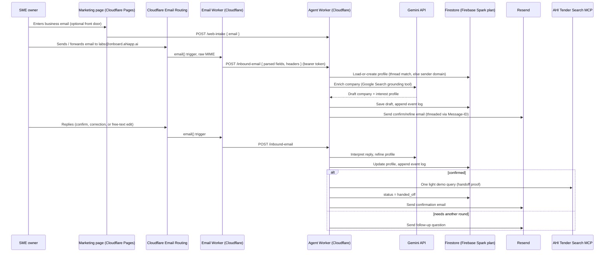

# Experience 1 — Onboarding Agent — Implementation Plan

**Scope of this repo:** Experience 1 only — "email us, you're in." Experience 2 (the weekly report agent) is a separate squad/repo; this repo only needs to produce the artifact Experience 2 consumes (a confirmed company/interest profile) and demonstrate the handoff with a light MCP query.

Source of truth: `AHI Hackathon — August 2026 — Build Brief - Actual.pdf` (kept local-only, see `.gitignore` — it's not committed).

---

## 1. What we're building

One agent behind a dedicated address (`labs@onboard.ahiapp.ai` — originally `radar.ahiapp.ai`, switched 2026-08-06 after discovering that name collided with an unrelated, pre-existing live product; see §7a), with a minimal marketing page as a second front door into the same flow:

```
email in (cold, or forwarded mid-thread, zero context)
  → domain-based company enrichment (Gemini + Google Search grounding)
  → draft profile emailed back: "here's what we found — confirm or add"
  → confirm/refine loop over email (repeat until confirmed)
  → save profile
  → hand off to Experience 2 (demonstrated via one light AHI MCP query)
```

**The hero mechanic:** forwardability. Onboarding has to survive arriving mid-thread, forwarded, with zero prior context — a colleague forwards "just email these guys" and the flow still works cold, keyed only off the sender's email domain, not off thread history we can't trust.

**Explicitly out of scope** (per brief): billing, login/accounts, WhatsApp/SMS, dashboards. The web page only markets and captures an email address; email does all the actual work; the MCP is barely touched (one demo query, not a search feature).

**Proved when:** a cold address goes end-to-end — email in → enriched profile back → confirmed — on the Gemini stack, and the enrichment reads researched, not templated.

---

## 2. Architecture

**Revised 2026-08-04** — originally planned around Cloud Run; changed after discovering no one on the team has a card to put on a GCP billing account (Cloud Run, like nearly all GCP compute products, requires an active Cloud Billing account regardless of whether usage stays free). The fix isn't a workaround — the brief's rule is "≥1 Google Cloud product," not "≥1 Cloud Run service," and Firestore has a permanently-free tier (Firebase's **Spark plan**) that never requires a card at all. So: everything runs on Cloudflare (already a paid account on the team, zero extra cost), and Firestore is the one distinct, unambiguous Google Cloud product in the deployed app.



**Why this split:**
- Two Cloudflare Workers, not one: `email-worker` stays a thin MIME-parsing adapter (unchanged from before); `agent-service` is now also a Cloudflare Worker (not Cloud Run) — it's the brain, calling Gemini, Firestore, and Resend. Splitting them keeps the inbound-mail parsing concern separate from the AI/business logic, same as originally planned — only the *hosting* of the second one changed.
- Firestore is the ≥1 Google Cloud product requirement, satisfied directly and unambiguously — not a token gesture, it's the actual profile + event-log store the whole flow depends on.
- The Gemini API call happens from `agent-service` regardless of what hosts it — Cloudflare Workers have unrestricted outbound HTTPS, so calling `generativelanguage.googleapis.com` works the same as it would from Cloud Run.
- No card, no billing account, no GCP project needed anywhere in this shape.

---

## 3. Stack decisions

| Layer | Choice | Why |
|---|---|---|
| Agent service | **Node.js / TypeScript**, **Hono**, on a **Cloudflare Worker** (`wrangler deploy`) | No card/billing account needed anywhere (see §2); same language + platform as `email-worker`, one deploy tool for both; Hono is the standard lightweight router for Workers, same request/response model Fastify had. |
| Inbound email | **Cloudflare Email Routing** → Worker (TypeScript) | Team already has a paid Cloudflare account; this is the standard, documented way to receive inbound mail without running our own SMTP. Worker parses MIME with `postal-mime`, then `fetch()`s the parsed payload to `agent-service`. |
| Outbound email | **Resend** | Per brief. One dedicated sending subdomain, threaded via `Message-ID`/`In-Reply-To`/`References`. |
| Web front door | Static page on **Cloudflare Pages** | Genuinely minimal — one form, one POST to the `agent-service` intake endpoint the email path also uses. No framework needed. |
| Profile + thread-state storage | **Firestore**, on Firebase's **Spark plan** | This is the ≥1 Google Cloud product requirement, satisfied directly — Spark is permanently free, no card ever, hard-capped quotas (1 GiB storage, 50K reads/20K writes per day) that a hackathon build won't come close to. Accessed via Firestore's REST API + a service-account JWT signed in-Worker (no Node-only Admin SDK, since Workers aren't Node). |
| AI | **Gemini API** (`gemini-3.6-flash` default) with the built-in **Google Search grounding** tool for enrichment, and the **MCP tool** registration pointed at `https://connect.ahiapp.ai/mcp` for the handoff-proof query | Confirmed live at `ai.google.dev/gemini-api/docs/custom-agents`. Called via plain HTTPS from the Worker using the API key the organizer already provided — no GCP project needed for this half of the brief's rule, only for the Firestore half. |
| Logging | A Firestore `events` collection + Cloudflare Workers' own request logs (`wrangler tail` / dashboard) | No Cloud Logging available without a GCP project, so the Firestore event log carries the "log everything" evidence trail — every inbound email, every Gemini call, every Resend send, every MCP call, in one place that's legible enough to screenshot for judging. |

None of this (except Gemini, Resend, Cloudflare Email Routing, and *some* Google Cloud product existing) is "don't debate, just build" territory per the brief — see the full mandated-vs-flexible breakdown the team worked through on 2026-08-04. The above are this squad's calls, and cheap to revisit if they cause friction.

---

## 4. Data model (Firestore, Firebase Spark plan)

**`profiles/{domainKey}`** — one doc per sender domain (e.g. `magellancircle.com`):
```
{
  domain: string,
  companyName: string | null,
  companyFacts: { industry, size, summary, sourceUrls: string[] },
  interestProfile: { sectors: string[], keywords: string[], buyers: string[], valueThreshold: number | null },
  contact: { email: string, name: string | null },
  status: "draft" | "awaiting_confirmation" | "confirmed" | "handed_off",
  rootMessageId: string | null,
  createdAt, updatedAt
}
```

**`profiles/{domainKey}/messages/{messageId}`** — every inbound/outbound email in the thread (direction, from, subject, body excerpt, `Message-ID`, `In-Reply-To`, `References`, parsedAt). This is what makes the confirm/refine loop and forwardability handling possible without re-parsing quoted history every time.

**`profiles/{domainKey}/events/{eventId}`** — append-only: `{ type: "inbound_email"|"gemini_call"|"resend_send"|"mcp_query", timestampMs omitted (server timestamp), payloadSummary, latencyMs, ok: boolean }`. This is the "log everything" evidence trail — it should be legible enough to screenshot for judging without needing to explain it.

**Forwardability / cold-start matching logic** (the hero mechanic):
1. Try to match `In-Reply-To`/`References` against a known `Message-ID` in `profiles/*/messages` — if it matches, this is a real reply in a thread we already know.
2. If no match (new thread, forwarded, headers stripped, zero prior context) — fall back to the **sender's email domain** only. If a profile already exists for that domain and isn't `handed_off`, treat this as a continuation (don't create a duplicate, don't assume we can read the forwarded quote history for state). If no profile exists, start fresh from the domain alone.

This is the concrete mechanism that satisfies "must survive arriving mid-thread, forwarded, with zero prior context" — the domain is the only anchor we ever trust; thread headers are a nice-to-have optimization, never a requirement.

---

## 5. Repo layout

```
apps/
  agent-service/   # Cloudflare Worker — the brain: Gemini calls, Firestore, Resend, MCP.
  email-worker/    # Cloudflare Worker — receives inbound mail, parses MIME, forwards to agent-service.
  web/             # Static marketing page — one form, deployed to Cloudflare Pages.
IMPLEMENTATION_PLAN.md
```

Each `apps/*` has its own `package.json`; the root `package.json` wires them as npm workspaces so `npm install` at the root sets up everything.

---

## 6. Day-by-day plan

Assumes the hackathon clock is **Monday Aug 10 → Friday Aug 14, 2026** (the brief just says "starts Monday, ends Friday" with no explicit date — adjust if the organizer confirms a different week). Sized for a 2-person squad.

| Day | Goal | Concrete output |
|---|---|---|
| **Mon** | Infra live, plumbing proven end-to-end with dummy logic | Firebase project (Spark plan, no card) created, Firestore enabled; `agent-service` deployed as a Cloudflare Worker with a hello-world handler; Cloudflare Email Routing wired to `email-worker`; `email-worker` successfully forwards a real inbound email's parsed fields to `agent-service` and it logs to Firestore. Resend sends one manual test email. **No Gemini yet — prove the pipes first.** |
| **Tue** | Enrichment works | Gemini API wired into `agent-service` with Google Search grounding; domain → company profile draft generated from a handful of real test domains; draft-confirm email actually sends via Resend, threaded correctly. |
| **Wed** | Confirm/refine loop + forwardability | Reply parsing (confirm / correction / free-text edit) drives profile updates; cold-start domain-matching logic built and tested by forwarding a real email mid-thread with quoted history stripped. |
| **Thu** | Handoff + hardening | On confirm: one light MCP query against `connect.ahiapp.ai/mcp` fires and logs; event log complete enough to screenshot; edge cases (bounces, ambiguous replies, repeated sends) handled gracefully; web front door wired to the same intake path. |
| **Fri** | Demo-ready | Full dry run: someone outside the build team emails the live address cold and gets onboarded, enriched, confirmed, without opening a browser. Logging/dashboard evidence polished. Deploy frozen by early afternoon for the live demo. |

---

## 7. Open blockers — need answers from the team/organizer before certain days can start

These aren't ours to assume past — flagging per the shared pre-split research:

- ~~**Domain/DNS**~~ — **Resolved 2026-08-04.** `ahiapp.ai` is already a Cloudflare zone under the team's own account (`Jd@j24d.com's Account` — same `j24d.com` the team is on). `radar.ahiapp.ai` is now live as its own subdomain via Email Routing's native **Subdomains** feature (Settings → Subdomains → add `radar.ahiapp.ai`), which provisions MX/DKIM/SPF scoped to that subdomain's own hostname — independent of the apex. **Do not touch the apex `ahiapp.ai` Email Routing "Add missing records" panel** — the apex already has live production mail via IONOS (`mx00/mx01.ionos.com`), and adding Cloudflare's SPF record on top of the existing IONOS one would create a second `v=spf1` TXT record at the same hostname, which is an SPF PermError (RFC 7208) and would risk real AHI mail deliverability. Routing rule `labs@radar.ahiapp.ai` is Active, currently pointed at a verified personal Gmail for testing — confirmed working end-to-end (a real external test email arrived correctly addressed to `labs`; it landed in Gmail's spam folder, but that's Gmail's generic content heuristic on an unfamiliar test sender, not an auth failure — and irrelevant once the Action is swapped from "Send to an email" to **"Send to a Worker"** pointed at `email-worker`, which has no mailbox/spam-filter step at all). **TODO:** flip that swap once `apps/email-worker` is deployed.
  - **Side discovery, not yet acted on:** this same Cloudflare zone already has a **Catch-all** rule and an `agent@agents.ahiapp.ai` rule, both routing to an existing deployed Worker called `tender-email-agent`, with real traffic (56 received/7 days on `agents.ahiapp.ai` per Cloudflare analytics). Unknown what this is — worth asking `haroon@j24d.com` or `jd@j24d.com` (both already destination addresses on this account) before assuming it's unrelated to this hackathon. Not touching it either way; `radar.ahiapp.ai` is a separate lane.
  - **Side discovery, relevant to Experience 2:** `filipe.ribeiro@magellancircle.eu` is already a verified-pending destination address on this same account (added ~5 days prior). Magellan Circle is Experience 2's named live test case, and "who has the real profile" was an open ask in the pre-split research — this looks like a real, existing contact link worth passing to that squad.
  - **Safety verification, requested by the team lead 2026-08-04:** confirmed live (not just recalled) that none of the above touched the apex or any pre-existing subdomain. `nslookup` against the real DNS after all changes: apex `ahiapp.ai` MX is still exactly `mx00/mx01.ionos.com` (unchanged); apex SPF TXT is still exactly `v=spf1 include:_spf-us.ionos.com ~all` (unchanged); `_dmarc.ahiapp.ai` is still the pre-existing CNAME to `dmarc.ionos.com` (unchanged — we cancelled rather than saved a conflicting record there, see below); `agents.ahiapp.ai` (the other, pre-existing, unrelated subdomain with real traffic) still resolves to the identical Cloudflare routing MX records it always had. Everything we added lives on brand-new names (`radar.ahiapp.ai`, `send.ahiapp.ai`/`send.send.ahiapp.ai`) that had no prior records, so nothing was overwritten.
  - **Side discovery while wiring Resend (below):** `_dmarc.ahiapp.ai` already exists as a CNAME to `dmarc.ionos.com` (IONOS's hosted DMARC service), and it's set to **"Proxied"** (orange cloud) in Cloudflare. CNAME records used for non-HTTP purposes (DMARC delegation, ACME challenges, etc.) are supposed to stay "DNS only" — a proxied `_dmarc` CNAME can interfere with how external mail servers resolve it, meaning AHI's actual DMARC policy may not have been resolving correctly. Worth flagging to `haroon@j24d.com`/`jd@j24d.com`; not ours to fix.
- ~~**GCP project + billing owner**~~ — **Resolved 2026-08-04.** No one on the team had a card, and Cloud Run (like nearly all GCP compute) requires an active Cloud Billing account regardless of usage staying free — confirmed, non-negotiable. Fix: dropped Cloud Run entirely. Firestore on Firebase's **Spark plan** needs no card, no billing account, no GCP project setup beyond creating a free Firebase project — that alone satisfies "≥1 Google Cloud product." `agent-service` moved to a Cloudflare Worker instead (see §2/§3). No billing owner needed at all now.
- ~~**Resend account + sending subdomain**~~ — **Resolved 2026-08-04.** Signed up at resend.com (free plan, no card — 3,000 emails/month, 100/day, indefinitely free). Added `send.ahiapp.ai` as a **dedicated sending subdomain**, deliberately separate from `radar.ahiapp.ai` (receiving) to avoid any SPF collision, per the brief's own wording ("a dedicated sending subdomain"). DKIM + SPF/MX added manually in the `ahiapp.ai` Cloudflare zone (Auto configure was skipped on purpose — it would have required granting Resend OAuth write-access to the whole Cloudflare account rather than just adding a few records by hand). Domain status: **Verified**, ready to send. Skipped the optional DMARC record entirely — Resend's suggested record targets the apex `_dmarc.ahiapp.ai`, which already has the IONOS CNAME above; DKIM + SPF alone are sufficient. Shared-ownership question with Experience 2's squad (if they also need Resend) is now moot for our purposes — this account/domain is set up and working regardless of who else uses Resend.
- **Gemini API key:** confirmed the team has one. Store it as a local `.env` (already gitignored) for dev and as a **Cloudflare Worker secret** (`wrangler secret put GEMINI_API_KEY`) for the deployed service — never commit it, never paste it into chat/PRs.
- ~~**Firebase project for Firestore**~~ — **Resolved 2026-08-04.** Firestore (Standard edition, default database) created on the Spark plan ($0/month). First attempt was under the `agentfoundrylabs.com` Google Cloud org, which blocked service-account key creation via an org policy (`iam.disableServiceAccountKeyCreation` — a deliberate security hardening setting, blocks it for every project in that org, not specific to us). Fix: recreated the Firebase project under a personal Google account instead (project ID `experience-one-cecae`), which has no org policies attached, so key creation worked immediately. Service-account key generated and saved into `apps/agent-service/.dev.vars` locally (gitignored, never committed). Fine for a hackathon-scoped project; if this ever needed to move under the company org, that's an org-policy-exception conversation, not a code change.
- ~~**AHI MCP endpoint auth**~~ — **Resolved 2026-08-04.** Confirmed by directly probing `https://connect.ahiapp.ai/mcp` with a raw MCP `initialize` request, no credentials attached: responded `200 OK` with a proper handshake (`"serverInfo":{"name":"Tender Data Cloudflare MCP Server"}`) and `Access-Control-Allow-Origin: *`. No auth needed — `agent-service` can call it directly (Streamable HTTP transport: POST JSON-RPC, reuse the returned `mcp-session-id` header for subsequent `tools/list`/`tools/call` requests).
- **"Confirmed" as a data event:** does a reply parse count, or do we want an explicit "yes, confirm" phrase/link? Affects the state machine in §4 — current plan assumes Gemini classifies free-text replies (confirm / edit / unclear), figure this is is the good working default from the reply loop unless the group prefers a stricter confirm mechanism.
- **Designer collaboration:** brief specifies "one squad, with the designer" for this experience — the marketing page and the tone/format of the confirm-email copy are the two places design input actually matters; loop them in before Thursday's polish pass, not Friday morning.

---

## 7a. Live deployment (as of 2026-08-05)

- Marketing page: `https://experience-one-web.pages.dev/` (Cloudflare Pages, direct upload — no Git integration set up, redeploy manually with `wrangler pages deploy apps/web --project-name experience-one-web` after changes)
- `agent-service`: `https://experience-one-agent-service.jd-ad0.workers.dev`
- `email-worker`: `https://experience-one-email-worker.jd-ad0.workers.dev`
- ~~`labs@radar.ahiapp.ai` routing rule flipped from the personal-Gmail test destination to **Send to a Worker → experience-one-email-worker**, confirmed Active.~~
- All four secrets (`GEMINI_API_KEY`, `RESEND_API_KEY`, `WORKER_SHARED_TOKEN`, `FIREBASE_SERVICE_ACCOUNT_JSON`) pushed to the deployed `agent-service` via `wrangler secret put`; `email-worker` has its own `WORKER_SHARED_TOKEN` secret matching. (`RESEND_API_KEY` is now unused, see below — left set, harmless.)
- Both Workers and the Pages project live under the `Jd@j24d.com's Account` Cloudflare account (`CLOUDFLARE_ACCOUNT_ID=ad0e82073fe55145813d96a272b9631f`) — the same one that owns `ahiapp.ai`, needed since Email Routing has to find the Worker in that account.

**Superseded 2026-08-06 — `radar.ahiapp.ai` → `onboard.ahiapp.ai`, and Resend → Cloudflare's native `send_email` binding.** While setting up `radar.ahiapp.ai` for outbound sending too (to unify send/receive on one address), discovered it wasn't actually free real estate — it collides with an existing, unrelated, live product also called "AHI Radar" (a tender-search website already running at that exact hostname from a prior hackathon). Switched the whole address to `labs@onboard.ahiapp.ai` instead. While making that change, also dropped Resend entirely in favor of Cloudflare's own native Email Sending — since `onboard.ahiapp.ai` is onboarded for both sending and receiving in the same Cloudflare account, there's no cross-vendor SPF conflict to work around (the reason `send.ahiapp.ai` and the `Reply-To` trick existed in the first place), so the whole split-domain workaround became unnecessary. Concretely:
- `onboard.ahiapp.ai` added as an Email Routing subdomain (inbound) and separately onboarded for Email Sending (outbound) — Cloudflare auto-coordinates one DNS setup covering both, confirmed via its own docs.
- `_dmarc.onboard.ahiapp.ai` manually softened from Cloudflare's default `p=reject` to `p=none` — sensible for a brand-new, still-being-tested sending domain; the *only* record on that domain marked "Unlocked" (safely editable) rather than "Locked."
- `agent-service`: `resend.ts` kept, not deleted, marked deprecated (`src/email.ts` is now the active client using the native `send_email` binding); `wrangler.toml`'s `RESEND_SENDING_DOMAIN`/`REPLY_TO_ADDRESS` commented out, replaced by one `AGENT_EMAIL_ADDRESS = "labs@onboard.ahiapp.ai"` var and a `[[send_email]] name = "EMAIL"` binding — no API key needed.
- Required upgrading `wrangler` from v3.80 to v4.119 across both Workers — v3's Miniflare recognized the new binding's config but didn't actually wire it into the runtime `env` locally, a version gap, not a code bug.
- Verified end-to-end locally post-swap: a fresh `j24d.com` submission ran real Gemini research (genuinely found and cited "J24D Lda.," "JD Piquard," "Project AHI" — not templated) through Firestore save through the new email binding, confirmed via direct Firestore read and the local email-simulation file. Redeployed `agent-service`; `apps/web/index.html`'s three `radar.ahiapp.ai` references (header, step copy, footer) updated to `onboard.ahiapp.ai` to match.

**Not yet proven live**, even though deployed: the confirm/refine reply loop, forwardability (the hero mechanic), and the MCP handoff query have never actually been triggered through the real, deployed path — only individual pieces have been verified in isolation so far (see §7 above).

## 8. Definition of done (demo script)

Mirrors the brief's own "demo moment" verbatim: someone **outside the build team**, from their **own inbox**, sends a cold email (or gets a forward with zero context) to the live address, and — without ever opening a browser — receives an enriched draft profile, confirms or edits it over email, and the system logs the whole thing and hands off to Experience 2's storage with one demonstrable MCP query. That's the acceptance test, not a synthetic one.
